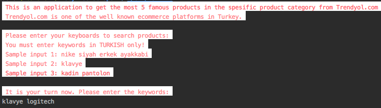
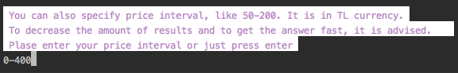
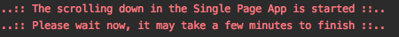
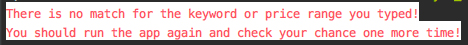
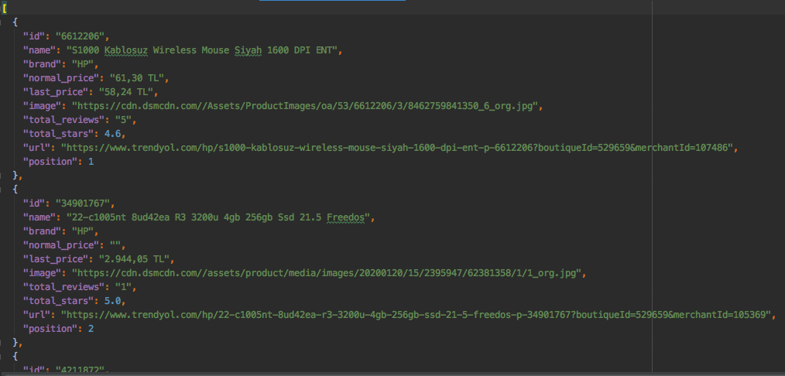
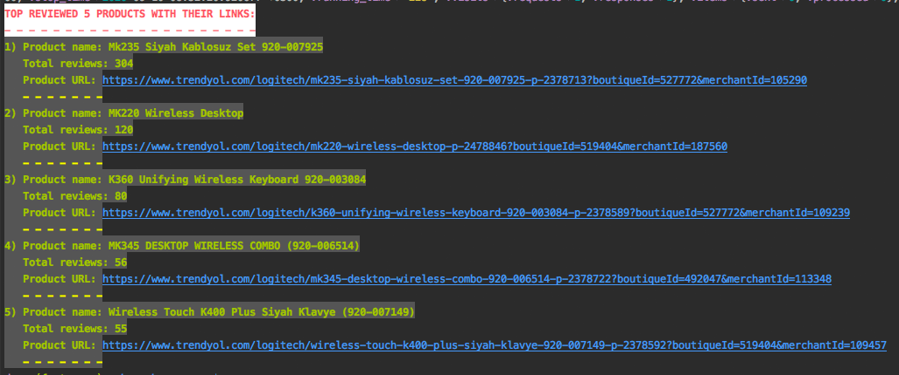
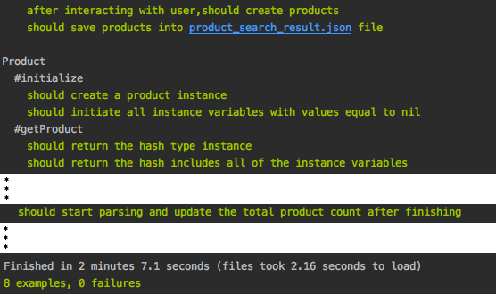

# Microverse Ruby Capstone Project -> Custom Web Scraper

This is a fashion follower application for helping individuals or companies to find out which kind of products are recommended more than others in the category if the interest.
The project is a web scraper and uses [kimurai](https://github.com/vifreefly/kimuraframework) gem to fetch data from the Single Page Application.
By default, the script is implemented brings the top 5 reviewed products from the specific category in the Trendyol.com.
Users can also specify price ranges from the command line interface if needed.
Both the category and the price range can be given from the command line interface. 
The category can be composed of several words, but it must be given in the Turkish language.

- [x] Milestone 1 - CLI user interface is implemented.
- [x] Milestone 2 - Implement logic to retrieve data from the webpage and store them in a JSON file.
- [x] Milestone 3 - Update codebase to follow OOP principles
- [x] Milestone 4 - Scraping data from Single Page Application
- [x] Milestone 5 - Rspec tests

## Rules To Run

- The category can be composed of several words, but it must be given in the Turkish language. You can see the examples below:
> If the user enters ```hp bilgisar``` (computer means "bilgisayar" mean in Turkish) and 300-4000 as a price range, then it will search all computers with the hp brand that costs between 300 and 4000 Turkish Lira.

> If the user enters ```Nike siyah erkek ayakkabi```, it will search for ```black Nike shoes for men```. 

## Built With

- Kimurai (it depends on [nokagiri](https://github.com/sparklemotion/nokogiri) gem)
- Ruby
- Rspec
- Rubocop

## Live Demo

[Live Demo Link](https://repl.it/@remki/ruby-web-scraper#README.md)

## Getting Started

To get a local copy up and running follow these simple example steps.

### Install
Besides the live demo link, you can run those functions in your own local environment. 
To run, you need to install RUBY on your computer. For windows, you can go to [Ruby installer](https://rubyinstaller.org/) and for MAC and LINUX you can go to [Ruby official site](https://www.ruby-lang.org/en/downloads/) for instructions on how to install it.
Then you can clone the project by typing ```git clone https://github.com/RaminMammadzada/ruby-web-scraper.git```

### Run app
1. In a terminal window type:
    - ```gem install kimurai```
    - ```gem install colorize```
2. Type ```./bin/main.rb``` in the root file of the project. 
You can also type ```ruby bin/main.rb``` in the root file of the project.
3. Follow the instructions given in the command-line interface.
    - Enter the category keywords
    
    - Enter the price range (you can also skip by pressing Enter)
    
    - Press Enter and wait some moment to get the results. The time to get the data depends on the total amount of products found.
    
        - All of the fetched products' informations are saved to [product_search_result.json](product_search_result.json) file.
        
        - If there is no product found, then it means there is no matching category for your keywords or you gave the price range too narrow. You should run the app again and try other keywords or price range.
        
    - Here you go! You got the 5 most reviewed products with their information.
    
     
### Run tests
In the terminal you just have to put the following command: 
```rspec```

## Testing the script

This script was tested using [RSpec](https://rspec.info/) which is a ruby testing tool. All public methods are tested.

### Install

- In a terminal window type ```gem install rspec```
- Once rspec install has finished, go to the project directory and type ```rspec --init```
- You will see a folder spec and a file [.rspec](.rspec)
- Inside spec folder you'll see a [spec_helper.rb](spec/spec_helper.rb) file.

### Run the test
- Open a terminal window and type ```rspec```
- All tests should be passed:

    


## Authors

👤 **Ramin Mammadzada**

- Github: [@RaminMammadzada](https://github.com/RaminMammadzada)
- Twitter: [@RaminMammadzada](https://twitter.com/RaminMammadzada)
- Linkedin: [@RaminMammadzada](https://www.linkedin.com/in/raminmammadzada) 

## 🤝 Contributing

Contributions, issues, and feature requests are welcome!

Feel free to check the [issues page](issues/).

## Show your support

Give a ⭐️ if you like this project!

## Acknowledgments

- Microverse
- Odin project

## 📝 License

This project is [MIT](lic.url) licensed.
